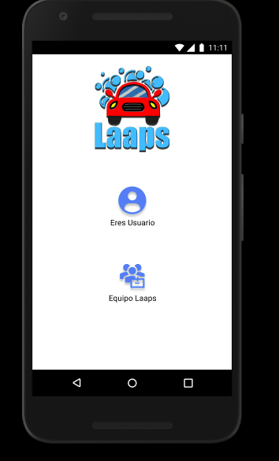
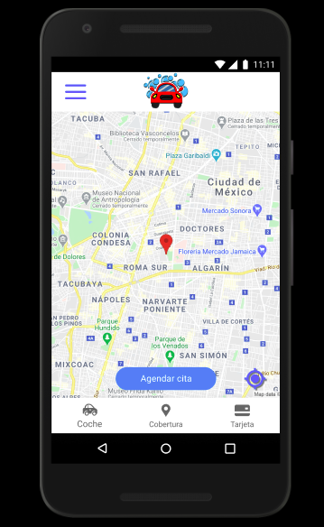
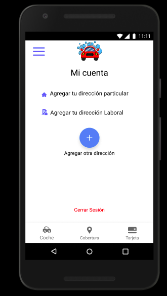
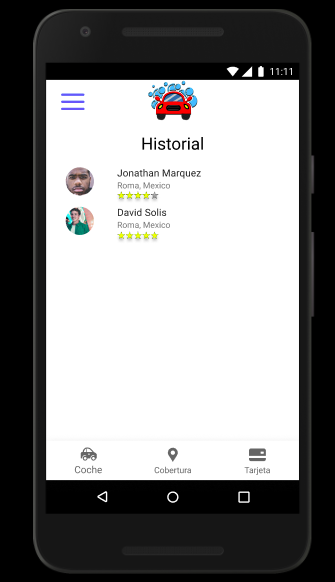
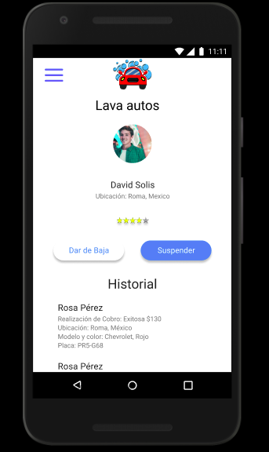
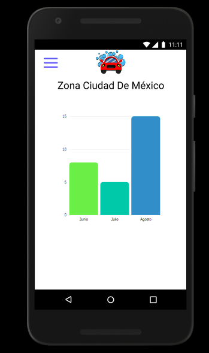

# Laaps

## Índice

* [1. Preámbulo](#1-preámbulo)
* [2. ¿Qué es Laaps?](#2-¿qué-es-Laaps?)
* [3. ¿Qué necesita Laaps?](#3-¿qué-necesita-Laaps?)
* [4. Prototipo](#4-prototipo)
* [5. App](#5-app)

## 1. Preámbulo

Uno de los grandes problemas que sufren millones de personas en distintas partes del país y del mundo, es la escasez del agua por lo que el ahorro de agua debe ser una prioridad para los ciudadanos.

La Ciudad de México tiene uno de los consumos de agua más elevados del mundo, con dotaciones de hasta 360 litros por habitante al día, según el Sistema de Aguas de la Ciudad de México. 
[Milenio](https://www.milenio.com/politica/comunidad/cuanta-agua-gasta-un-mexicano-al-dia)

Alrededor de 5 por ciento de ese consumo se utiliza en actividades diarias como limpieza personal, mientras que el 95 por ciento restante corresponde a hábitos alimenticios, patrones de consumo y estilo de vida.

Una de las actividades que realizamos cotidianamente es lavar los autos, pero sabemos ¿cuál es impacto que tiene?
Lavado por manguera se consumen 12 litros por minuto. 
Consumimos 40-50 litros por lavar a cubetadas o lavado a presión por vehículo.
Carwash convencional puede gastar hasta 70 litros de agua.

## 2. ¿Qué es Laaps?

Laaps un emprendimiento dedicado al lavado de autos a domicilio sin utilizar agua.
Laaps es innovador porque es el primer autolavado que no utiliza agua.
 Llegan  a donde se solicita y sus clientes no necesitan esperar ni hacer filas.
 
 Utilizan productos naturales que protegen el auto de la intemperie y al mismo tiempo son amigables con el medio ambiente.
 
## 3. ¿Qué necesita Laaps?
Buscan transformar su negocio en un negocio escalable y con más visibilidad. 
Se necesita diseñar y desarrollar una webapp (tipo Uber) a través de la cual los usuarios puedan fácilmente acceder y pedir el servicio de lavado de auto determinando la ubicación a través de algún servicio de geolocalización, y al mismo tiempo puedan saber quién lavará su auto, cuánto tiempo tomará, etc. 

Y por otro lado, que la webapp le permita a la directora y al equipo de ventas (como administradoras) conocer los detalles de su negocio más amplia y detalladamente para así poder analizar y tomar decisiones sobre este. 

4. Prototipo
  
  
  

## 5. App

Para acceder a la app visitanos [aqui](https://laaps.vercel.app/)

